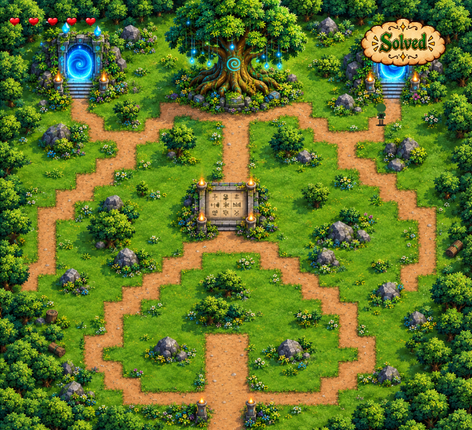
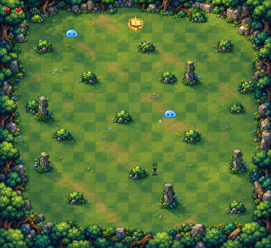

# The Mystic Grove

## Game Description

**The Mystic Grove** is a simple graphics project created using the **iGraphics** library in C. The project demonstrates basic graphics programming concepts like drawing shapes, handling user input, and simple animations.

## Features
- Player Movement: Controls a player moving at any direction.
- Shooting Mechanics: Players can shoot spells to defeat enemies in each portals.
- Puzzle System: Two puzzles on different portals to unlock regions.
- Power-Ups: Spell Upgrade and Speed boost.
- Health Upgrade System: Solving second puzzle increases health.
- Boss Battle: After completing all 3 portals, boss level unlocks.
- Game Over Conditions: The game ends if the health bar of the player reaches zero.

## Project Details
IDE: Visual studio 2010/2013

Language: C,C++.

Platform : Windows PC.

Genre : 2D action adventure fantasy

## How to Run the Project

Make sure you have the following installed:
- **Visual Studio 2013**
- **MinGW Compiler** (if needed)
- **iGraphics Library** (included in this repository)

Open the project in Visual Studio 2013
- Open Visual Studio 2013.
- Go to File → Open → Project/Solution.
- Locate and select the .sln file from the cloned repository.
- Click Build → Build Solution
- Run the program by clicking Debug → Start Without Debugging

## How to Play

### **Controls**
- 'w' to move straight
- 'a' to move left
- 's' to move back
- 'd' to move right
-  SPACE bar to shoot
-  c to shoot in final stage

### **Game Rules**

- Player starts with 3 health points.
- Attacks reduce the opponent’s health based on the type of enemy 
- Solving puzzle grants 2 extra health points
- Clearing portals grant power-ups like spells 

## Project Contributors

1. Faheem Shahrier

2. Maimuna Alam

3. Farhan Shadid

## Screenshots

### **Main Map**

### **Portal**

## Youtube Link
[CSE 1200 Project: The Fallen Kingdom](https://www.youtube.com/)

## Project Report
[Project Report: The Fallen Kingdom](https://drive.google.com/drive/u/1/my-drive)
